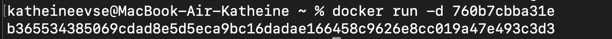

## Part 1. Готовый докер
1.1 Взять официальный докер образ с nginx и выкачать его при помощи docker pull
```
команда - docker pull nginx
```


1.2 Проверить наличие докер образа через docker images
``` 
команда - docker images
```


1.3 Запустить докер образ через docker run -d [image_id|repository]
``` 
команда - docker run -d 760b7cbba31e
```


1.4 Проверить, что образ запустился через docker ps
``` 
команда - docker ps
```


1.5 Посмотреть информацию о контейнере через docker inspect [container_id|container_name]
``` 
команда - docker inspect b36553438506
```

По выводу команды определи и помести в отчёт 

`размер контейнера`,


`список замапленных портов` 


`ip контейнера`

