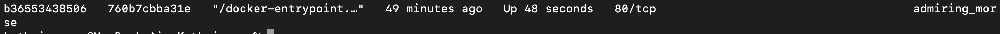

## Part 1. Готовый докер
#### 1.1 Взять официальный докер образ с nginx и выкачать его при помощи docker pull
```
команда - docker pull nginx
```


#### 1.2 Проверить наличие докер образа через docker images
``` 
команда - docker images
```


#### 1.3 Запустить докер образ через docker run -d [image_id|repository]
``` 
команда - docker run -d 760b7cbba31e
```


#### 1.4 Проверить, что образ запустился через docker ps
``` 
команда - docker ps
```


#### 1.5 Посмотреть информацию о контейнере через docker inspect [container_id|container_name]
``` 
команда - docker inspect b36553438506
```

По выводу команды определи и помести в отчёт:

`размер контейнера`,


```список замапленных портов```


`ip контейнера`


#### 1.6 Остановить докер образ через docker stop [container_id|container_name]
``` 
команда - docker stop b36553438506
```


#### 1.7 Проверить, что образ остановился через docker ps                
``` 
команда - docker ps
```


#### 1.8 Запустить докер с замапленными портами 80 и 443 на локальную машину через команду run
``` 
команда - docker run -p <порт_на_локальной_машине>:<порт_в_контейнере> <имя_образа>
или 
docker run -p 80:80 - d -p (в фоновом режиме) -p 443:443 760b7cbba31e
```


#### 1.9 Проверить, что по адресу localhost:80 доступна стартовая страница nginx


#### 1.10 Перезапустить докер контейнер через docker restart [container_id|container_name]
``` 
команда - docker restart b36553438506
```

#### 1.11 Проверить любым способом, что контейнер запустился
``` 
команда - docker ps
```


## Part 2. Операции с контейнером
2.1 Прочитать конфигурационный файл nginx.conf внутри докер контейнера через команду exec
``` 
команда - docker exec b36553438506 cat /etc/nginx/nginx.conf
```

