## Part 1. Готовый докер
#### 1.1 Взять официальный докер образ с nginx и выкачать его при помощи docker pull
```
команда - docker pull nginx
```


#### 1.2 Проверить наличие докер образа через docker images
``` 
команда - docker images
```


#### 1.3 Запустить докер образ через docker run -d [image_id|repository]
``` 
команда - docker run -d 760b7cbba31e
```


#### 1.4 Проверить, что образ запустился через docker ps
``` 
команда - docker ps
```


#### 1.5 Посмотреть информацию о контейнере через docker inspect [container_id|container_name]
``` 
команда - docker inspect b36553438506
```

По выводу команды определи и помести в отчёт:

`размер контейнера`,


```список замапленных портов```


`ip контейнера`


#### 1.6 Остановить докер образ через docker stop [container_id|container_name]
``` 
команда - docker stop b36553438506
```
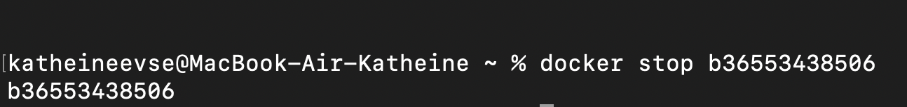


#### 1.7 Проверить, что образ остановился через docker ps                
``` 
команда - docker ps
```


#### 1.8 Запустить докер с замапленными портами 80 и 443 на локальную машину через команду run
``` 
команда - docker run -p <порт_на_локальной_машине>:<порт_в_контейнере> <имя_образа>
или 
docker run -p 80:80 - d -p (в фоновом режиме) -p 443:443 760b7cbba31e
```


#### 1.9 Проверить, что по адресу localhost:80 доступна стартовая страница nginx


#### 1.10 Перезапустить докер контейнер через docker restart [container_id|container_name]
``` 
команда - docker restart b36553438506
```

#### 1.11 Проверить любым способом, что контейнер запустился
``` 
команда - docker ps
```

## Part 2. Операции с контейнером
##### 2.1 Прочитать конфигурационный файл nginx.conf внутри докер контейнера через команду exec
``` 
docker run -d -p 80:80 760b7cbba31e
команда - docker exec b36553438506 cat /etc/nginx/nginx.conf
```


##### 2.2 Создать на локальной машине файл nginx.conf
##### 2.3 Настроить в нем по пути /status отдачу страницы статуса сервера nginx


#### 2.3 Скопировать созданный файл nginx.conf внутрь докер образа через команду docker cp
```  container_id
команда - docker cp nginx.conf b36553438506:/etc/nginx/
```


#### 2.4 Перезапустить nginx внутри докер образа через команду exec
``` 
команда - docker exec b36553438506 nginx -s reload
```
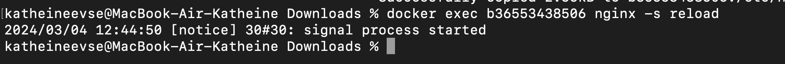

// пришлось запустить новый контейнер из-за ошибок 


#### 2.5 Проверить, что по адресу localhost:80/status отдается страничка со статусом сервера nginx
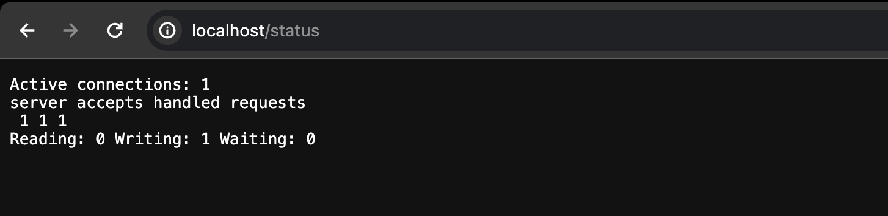


#### 2.6 Экспортировать контейнер в файл container.tar через команду export
``` 
команда - docker export 7eb4f6d7a900 > container.tar
```

#### 2.7 Остановить контейнер
``` 
команда - docker stop magical_moore()
```


#### 2.8 Удалить образ через docker rmi [image_id|repository], не удаляя перед этим контейнеры
``` 
команда - docker rmi 7eb4f6d7a900 -f (image_id)
```
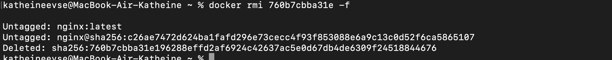

#### 2.9 Удалить остановленный контейнер
``` 
команда - docker rm magical_moore
```
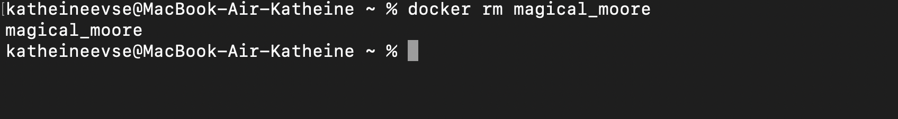

#### 2.10 Импортировать контейнер обратно через команду import
``` 
команда - docker import -c 'cmd ["nginx", "-g", "daemon off;"]' -c 'ENTRYPOINT 
          ["/docker-entrypoint.sh"]' /screenshots/container.tar nginx_imp
```
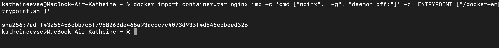
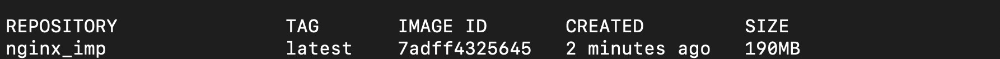


#### 2.11 Запустить импортированный контейнер
``` 
команда - docker run -d -p 80:80 7adff4325645
```


#### 2.12 Проверить, что по адресу localhost:80/status отдается страничка со статусом сервера nginx
``` 
команда - curl localhost:80/status
```
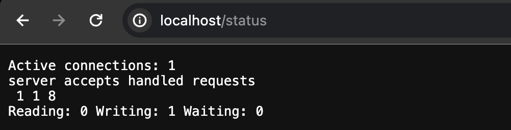

## Part 3. Мини веб-сервер
#### 3.1 Написать мини сервер на C и FastCgi, который будет возвращать простейшую страничку с надписью Hello World!
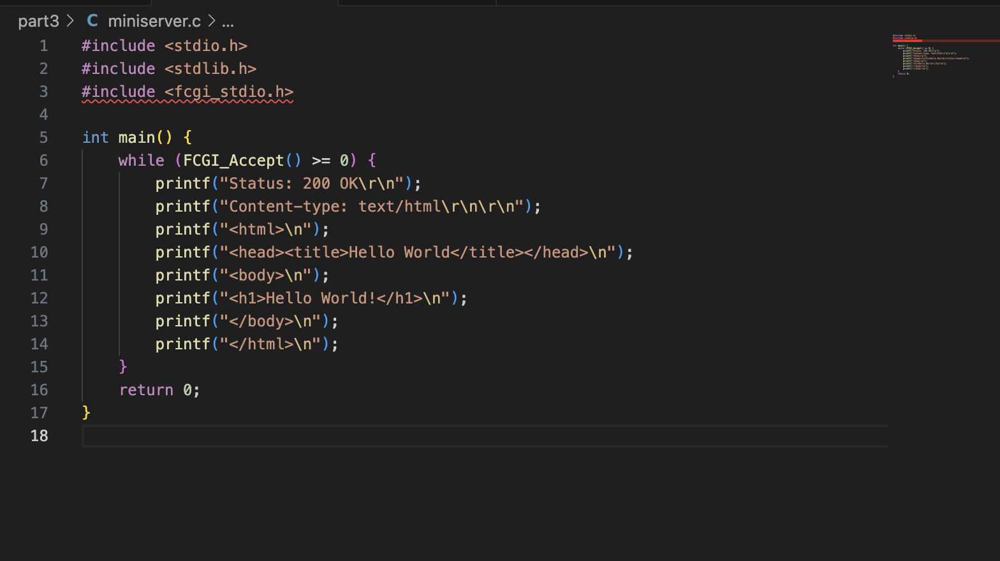

#### 3.2 Запустить написанный мини сервер через spawn-fcgi на порту 8080

Последоватлеьность действий:
``` 
docker pull nginx
docker images
docker run -d -p 81:81 [IMAGE_ID](760b7cbba31e)
```

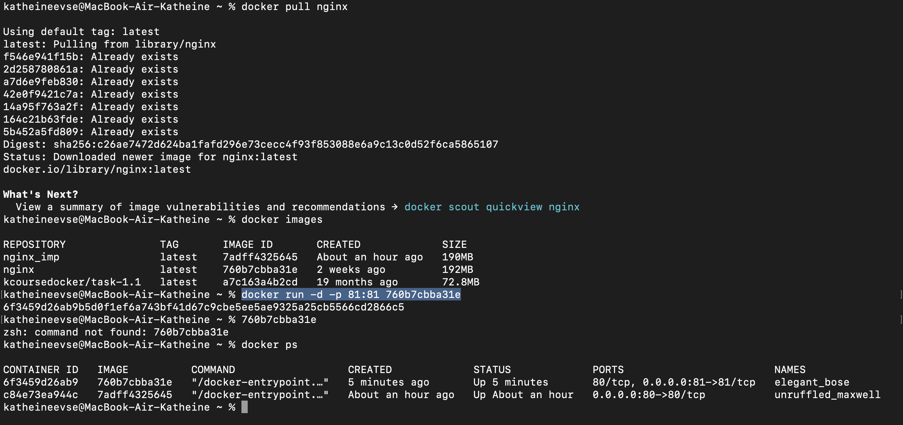
``` 
docker cp nginx.conf [CONTAINER ID]:/etc/nginx/
docker cp server.c [CONTAINER ID]:/home/
docker exec -it [CONTAINER ID] bash     // чтобы подключиться к контейнеру
```
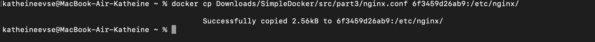
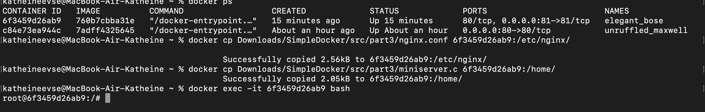

``` 
apt-get update
apt-get install gcc
apt-get install spawn-fcgi
apt-get install libfcgi-dev
gcc *.c -lfcgi
spawn-fcgi -p 8080 /screenshots/a.out
nginx -s reload
```
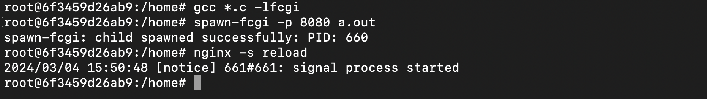

#### 3.3 Написать свой nginx.conf, который будет проксировать все запросы с 81 порта на 127.0.0.1:8080 (3.2)

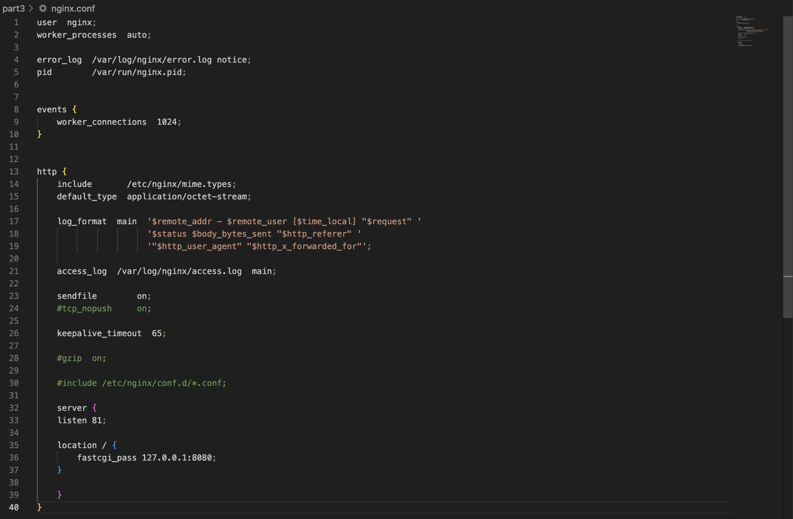

#### 3.4 Проверь, что в браузере по localhost:81 отдается написанная тобой страничка.

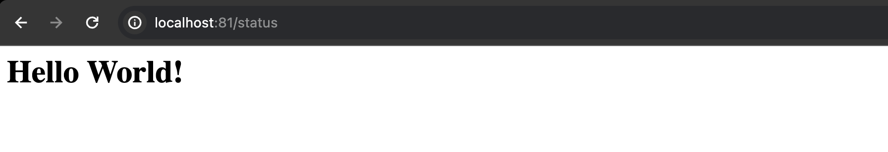
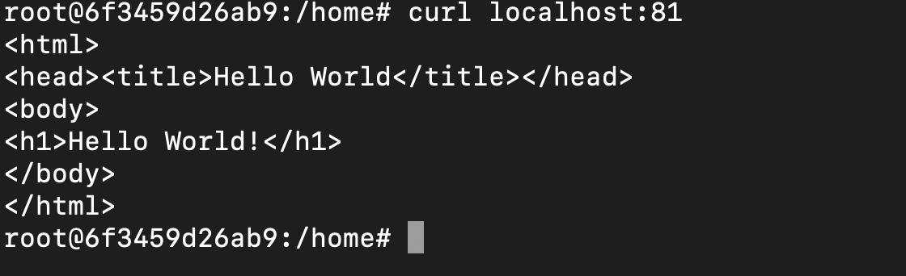


